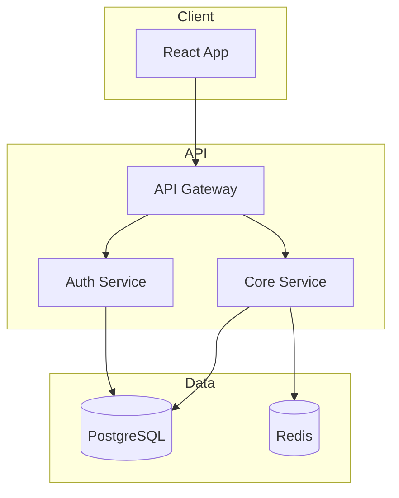
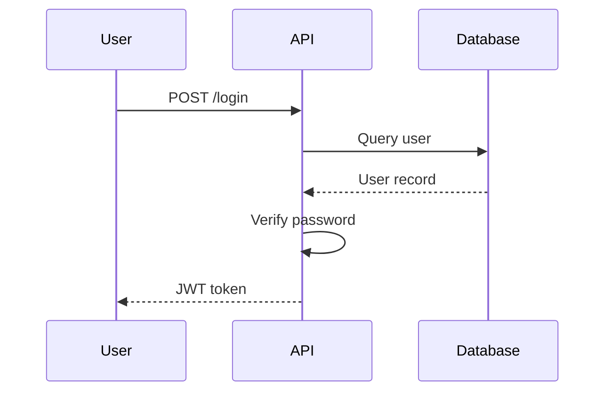
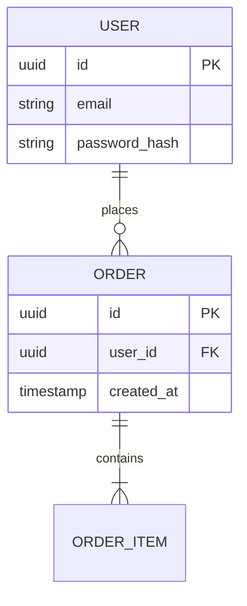

# COMMAND: DIAGRAM

# ALIAS: viz, mermaid, architecture-viz, draw

## OBJECTIVE

**VISUAL DOCUMENTATION.**
A picture is worth a thousand lines of code.
**Your Goal**: Generate architecture diagrams that help humans AND AI understand the system.
**Tool**: Mermaid (renders in GitHub, Notion, most modern tools).

## WHEN TO USE

| Situation | Create Diagram? |
|-----------|-----------------|
| New feature touches multiple components | ✅ Yes |
| Onboarding someone to codebase | ✅ Yes |
| Complex data flow | ✅ Yes |
| Single-file change | ⛔ Overkill |

## PROTOCOL

### Phase 1: Identify Diagram Type

| Type | Use For | Mermaid Syntax |
|------|---------|----------------|
| **Flowchart** | Control flow, decisions | `flowchart TD` |
| **Sequence** | API calls, message passing | `sequenceDiagram` |
| **Class** | Domain model, relationships | `classDiagram` |
| **ER** | Database schema | `erDiagram` |
| **State** | State machines, workflows | `stateDiagram-v2` |

### Phase 2: Scope the Diagram

**One concept per diagram. Don't cram everything.**

1. **System Overview**: High-level components and connections
2. **Feature Flow**: How a specific feature works
3. **Data Model**: Entities and relationships
4. **Sequence**: Step-by-step interaction

### Phase 3: Generate Mermaid

**Example: System Overview**



**Example: UI Target Matrix (Overview)**

```mermaid
flowchart TB
    subgraph UI["UI (Leptos/Reflex)"]
        App[App (Shared Code)]
    end

    subgraph Shells["Shell Adapters"]
        Web[Web Server]
        Tauri[Tauri Desktop]
        Mobile[Tauri/Capacitor Mobile]
    end

    subgraph Backend["Backend/API"]
        API[HTTP API]
    end

    subgraph Data
        DB[(PostgreSQL)]
    end

    App --> Web
    App --> Tauri
    App --> Mobile
    Web --> API
    Tauri --> API
    Mobile --> API
    API --> DB
```

**Example: Sequence Diagram**



**Example: Data Model**



### Phase 4: Place in Docs

1. **Location**: `docs/diagrams/` or inline in relevant `.md`
2. **Naming**: `[feature]-[type].md` (e.g., `auth-sequence.md`)
3. **Link**: Reference from `architecture.md`

## OUTPUT FORMAT

**The Diagram File**

```markdown
# [Feature] Architecture

## Overview
[One sentence describing what this shows]

## Diagram

```mermaid
[diagram code]
```

## Components

- **[Name]**: [Description]
- **[Name]**: [Description]

## Notes

- [Any important context]

## EXECUTION RULES

1. **ONE CONCEPT**: Don't combine sequence + class + ER in one diagram
2. **LABEL EVERYTHING**: No mystery boxes
3. **UPDATE ON CHANGE**: Diagram must match code
4. **RENDER CHECK**: Verify Mermaid syntax is valid
5. **LINK BOTH WAYS**: Docs link to code, code comments link to docs

## AI GUARDRAILS

| ⛔ Banned | ✅ Required |
|----------|-------------|
| Undocumented boxes | Clear labels |
| Outdated diagrams | Update with code changes |
| Overly complex (>15 nodes) | Split into multiple diagrams |
| Implementation details | Architectural concepts |

## VIBE CODING INTEGRATION

Diagrams help AI maintain context:

- Reference diagram when asking AI about architecture
- AI can update diagrams when changing architecture
- Visual confirmation prevents AI context drift
